# Open-Source Infographic Cards

Purpose-built, shareable knowledge cards for the parental-alienation field. Each card is designed for a specific educational job — vocabulary, statistic, framework, or tactic — and is intended to be embedded, reposted, and used in advocacy/educational contexts.

All cards: 1200×630 PNG, CC BY 4.0, attribution to [AntiAlienate.com](https://www.antialienate.com).

## Frameworks

### Bernet's 5-Factor Model of Parental Alienation

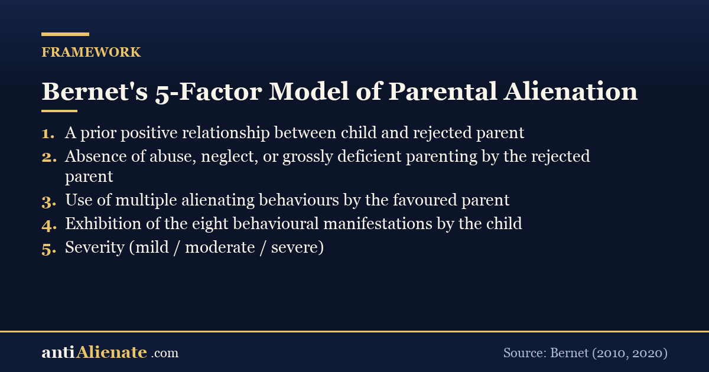

The diagnostic spine: five factors that distinguish PA from estrangement.

### Eight Behavioural Manifestations of PA (Bernet)

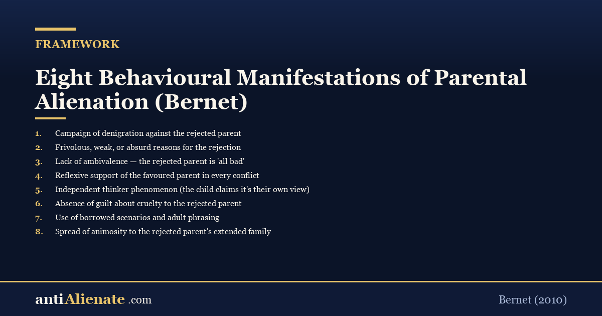

The eight observable child-behaviour markers Bernet uses to identify alienation.

### Strand Lobben v Norway — ECHR Article 8 doctrine

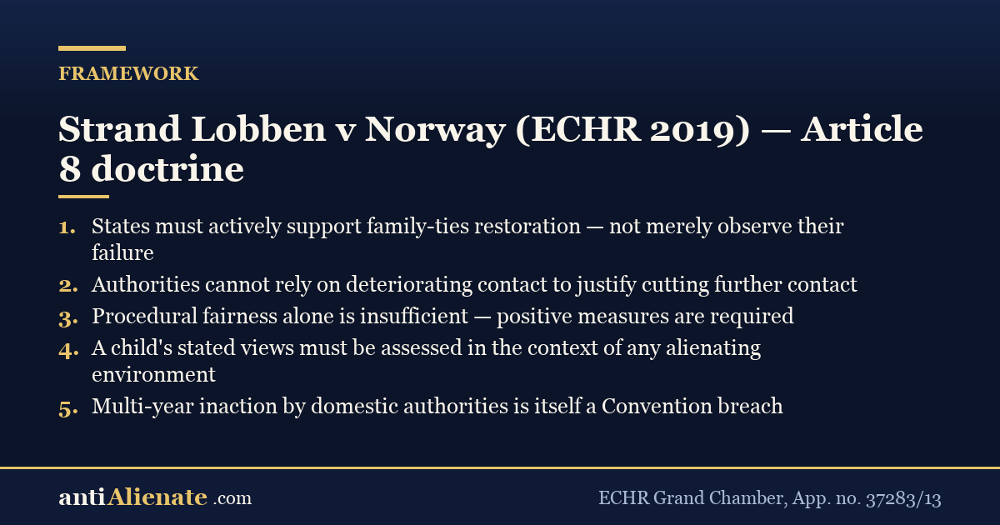

The grand-chamber case that requires states to actively support family-ties restoration.

## Statistics

### ICD-11 QE52.2 — Caregiver-child relationship problem

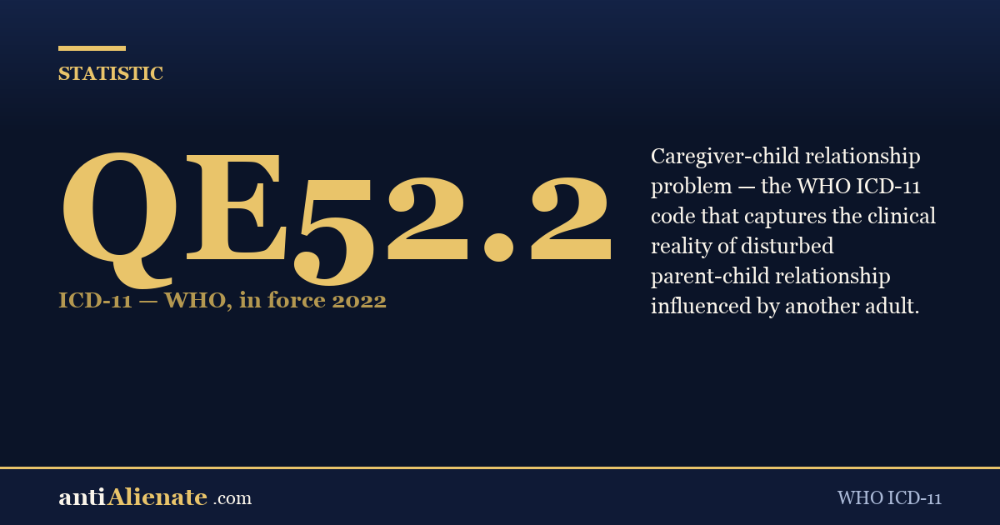

The WHO clinical code that names the dynamic. In force since 2022.

### 85% of children with behavioural disorders come from fatherless homes

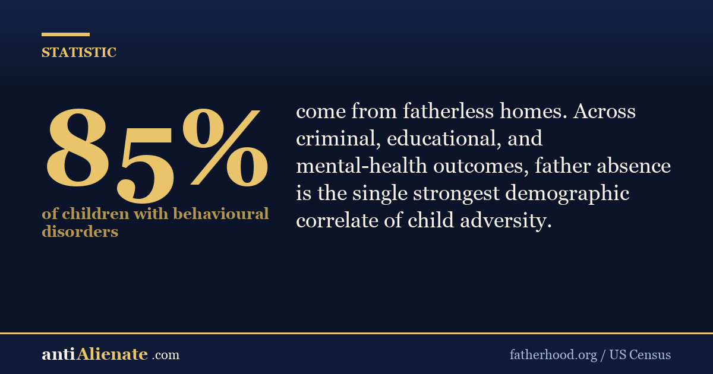

US Census / fatherhood.org statistic on father-absence as a child-adversity correlate.

## Vocabulary

### Astreintes (Belgium / France / Netherlands)

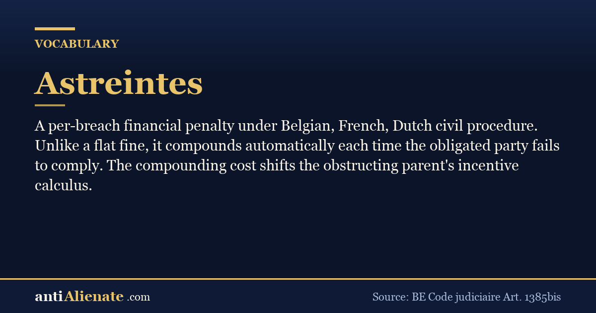

A per-breach financial penalty that compounds — stronger than flat fines.

### Affido super-esclusivo (Italy)

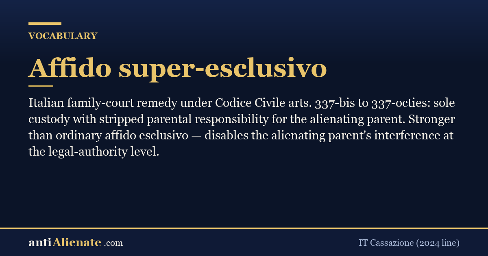

Italian sole-custody-with-stripped-parental-authority remedy.

### Gezagsbeëindiging (Netherlands)

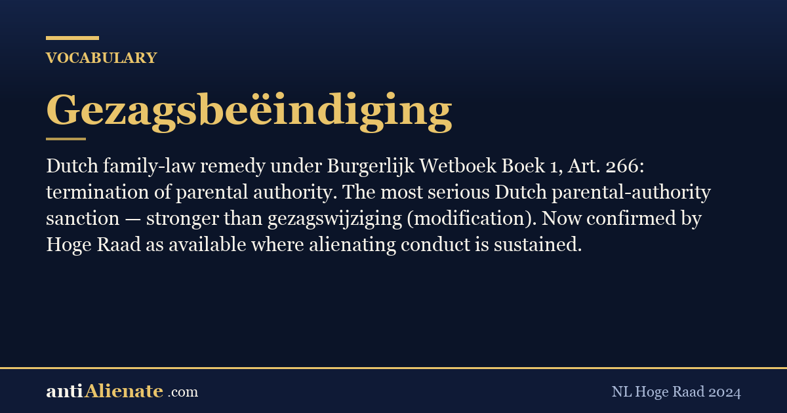

Dutch termination-of-parental-authority remedy under BW Boek 1 Art. 266.

### Troxel v. Granville (SCOTUS 2000)

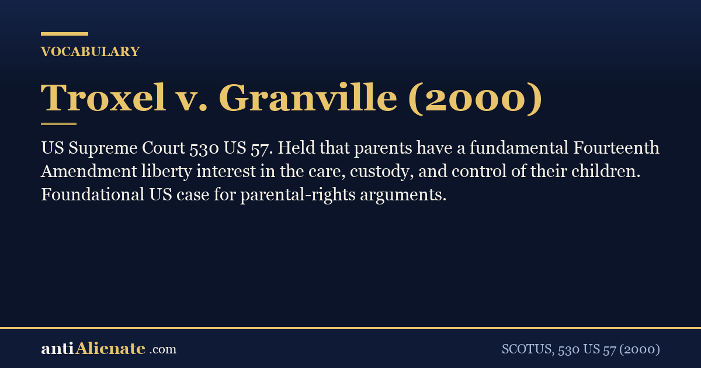

Foundational US Supreme Court case affirming parents' fundamental 14th-Am liberty interest.

## Tactics

### Three things to prepare before Cafcass / GAL / court-psychologist interview

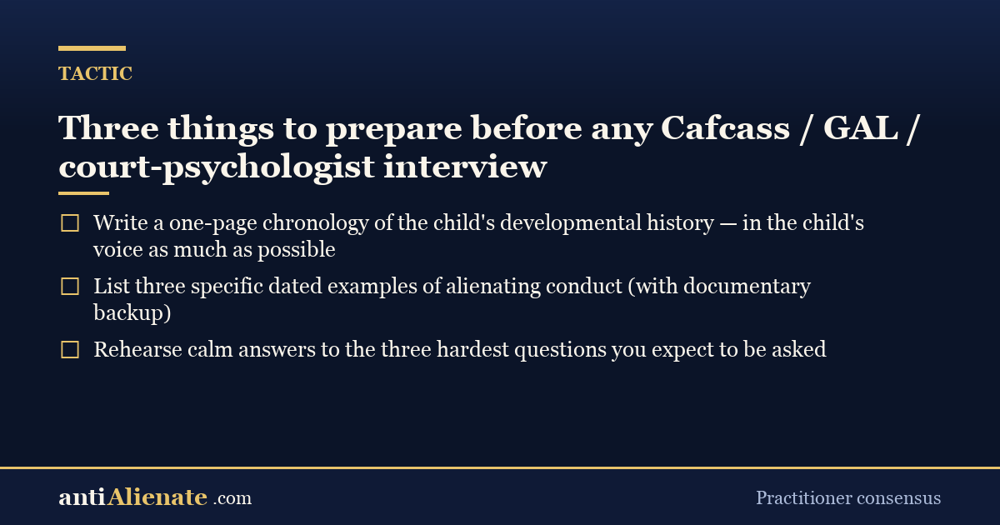

Practitioner-consensus prep checklist for the highest-stakes interview in your case.

### The contact-log spreadsheet that wins cases

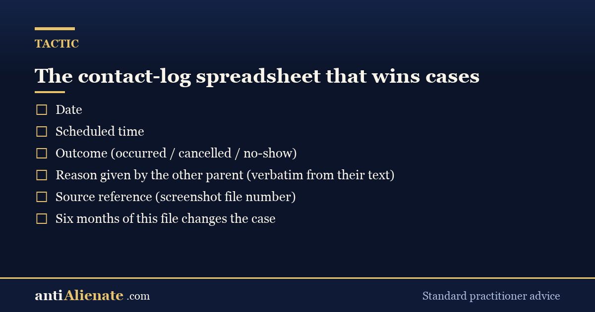

Column structure for the dated contact log that beats any oral testimony.

### Use GDPR Art. 15 to pull the school's full file on your child

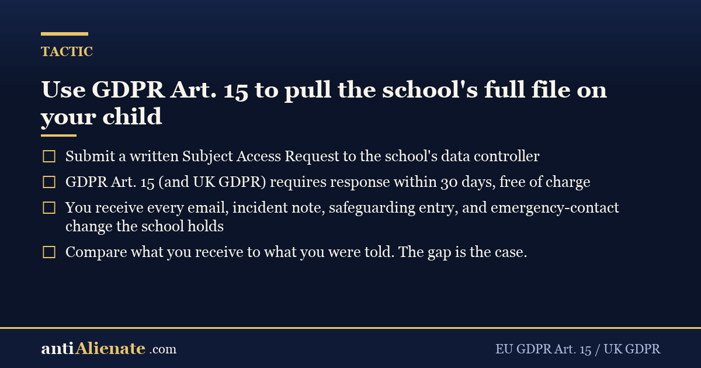

How to get everything the school holds about your child — free, in 30 days.

---

## Using these cards

- Embed directly in your blog, advocacy site, or social post.
- Adapt and remix under CC BY 4.0 — credit AntiAlienate.com.
- New card requests via GitHub issue. PRs welcome (use `/tmp/.aa-secrets/make-card-v1.py` as the generator).

— Curated by Alan Markson · [AntiAlienate.com](https://www.antialienate.com) · CC BY 4.0